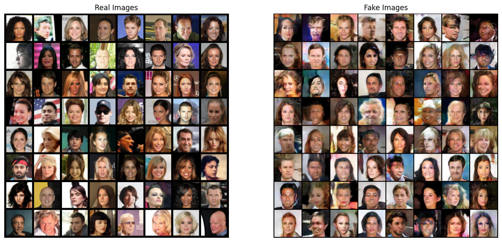
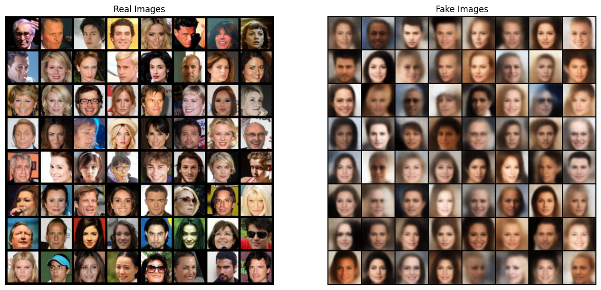

# GAN & VAE

This repository contains the implementation of following models from scratch in Pytorch:
- Deep Convolutional Generative Adversarial Networks (DCGAN)([arXiv:1511.06434](https://arxiv.org/abs/1511.06434))
- Variational Autoencoder (VAE)([arXiv:1312.6114](https://arxiv.org/abs/1312.6114))

## Results

The following images are generated by the DC-GAN model and VAE model after training on the CelebA dataset.

    

    

## Acknowledgement
Most of the code for DCGAN is taken from the official Pytorch [tutorial](https://pytorch.org/tutorials/beginner/dcgan_faces_tutorial.html) and the code for VAE is taken from the following [repository](
 https://github.com/AntixK/PyTorch-VAE)