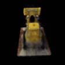

# Tiny_NeRF

This is a PyTorch implementation of **Tiny NeRF**, a simplified version of the [NeRF](https://arxiv.org/abs/2003.08934) model. The model is trained on a set of images of a Lego set and is used to render a 360-degree view of the scene.

## Simplifications

The components that are not included in this implementation are:

* **5D Input (Spatial + Viewing Directions):** The original NeRF paper uses a 5D input that includes spatial coordinates (x, y, z) and viewing directions (θ, φ). In Tiny NeRF, the model is simplified by only using the 3D spatial coordinates (x, y, z).
* **Hierarchical Sampling:** The original NeRF paper introduces hierarchical sampling, where a coarse model first samples points along a ray, and then a fine model refines this sampling. In Tiny NeRF, I've simplified this by using uniform sampling along the ray.

## Usage

The code is run in **Google Colab**. The notebook is self-explanatory and includes comments for each cell.

## Results

The model was trained for 1000 iterations on Lego set images. The final rendered 360-degree view of the scene is shown below:

## Acknowledgements

The notebook template was developed by the faculty of Cornell University as part of their **CS5670** course.
